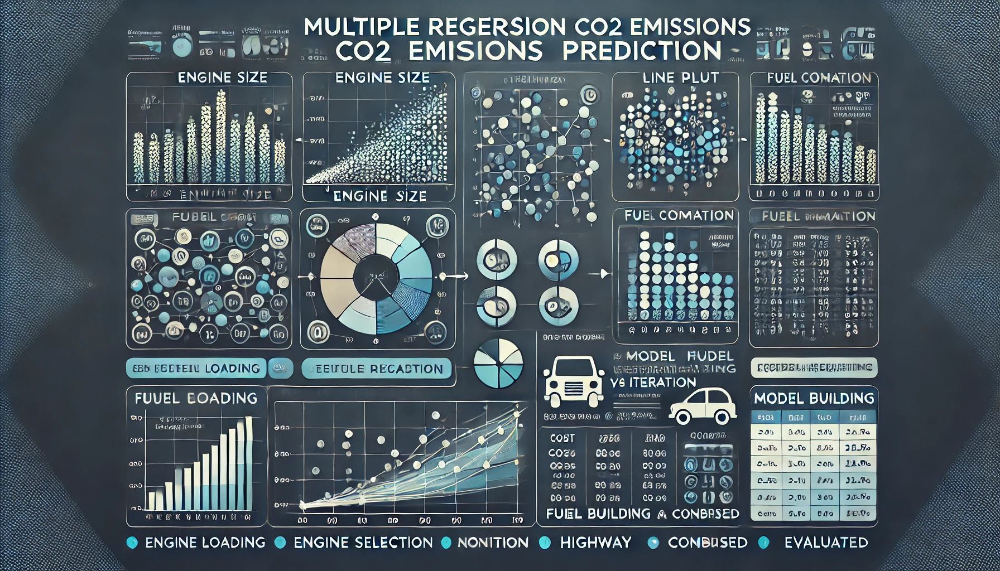

<div style="text-align: center;">
    
</div>


# CO2-Emission-Multiple-Linear-Regression

This project involves developing a multiple linear regression model to predict CO2 emissions based on various influencing factors. The model aims to analyze relationships between these factors and CO2 emissions, providing accurate forecasts and insights for environmental decision-making.

## Table of Contents
- [Introduction](#introduction)
- [Dataset](#dataset)
- [Installation](#installation)
- [Usage](#usage)
- [Results](#results)
- [Contributing](#contributing)
- [License](#license)

## Introduction
In this project, we aim to predict CO2 emissions using multiple linear regression. By analyzing various factors such as vehicle characteristics and fuel consumption, the model helps in understanding the contribution of each factor to CO2 emissions. This can aid policymakers and researchers in devising strategies to reduce emissions.

## Dataset
The dataset used in this project includes:
- Vehicle characteristics (make, model, year, etc.)
- Fuel consumption metrics
- CO2 emissions data

The data is preprocessed to handle missing values, outliers, and categorical variables to make it suitable for regression analysis.

## Installation
To run this project, you need to have Python installed along with the following libraries:
```bash
pip install numpy pandas matplotlib scikit-learn
```

## Usage
1. Clone the repository:
    ```bash
    git clone https://github.com/HoomKh/CO2-Emission-Multiple-Linear-Regression.git
    ```
2. Navigate to the project directory:
    ```bash
    cd CO2-Emission-Multiple-Linear-Regression
    ```
3. Run the Jupyter notebook:
    ```bash
    jupyter notebook Multiple\ Regression\ CO2EMISSIONS\ Prediction.ipynb
    ```

## Results
The results include:
- Summary statistics of the dataset
- Regression model coefficients
- Model performance metrics (R-squared, Mean Squared Error, etc.)
- Visualization of actual vs predicted CO2 emissions

## Contributing
Contributions are welcome! Please fork the repository and submit a pull request with your improvements or bug fixes.

## License
This project is licensed under the MIT License. See the [LICENSE](LICENSE) file for details.

---
